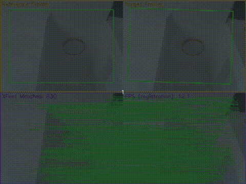
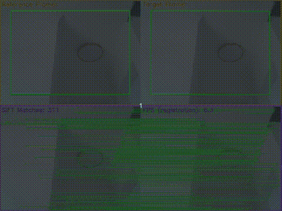
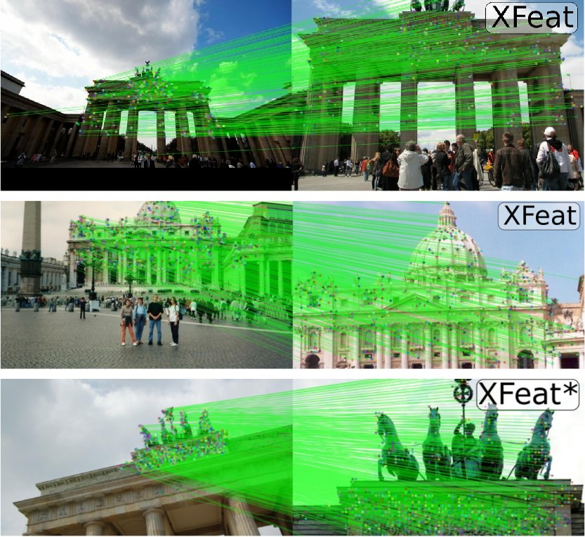
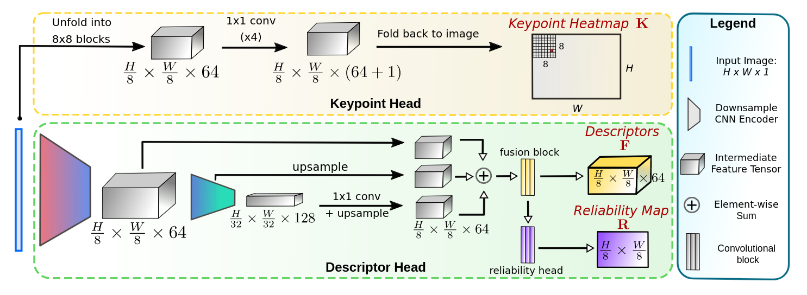

## XFeat: Accelerated Features for Lightweight Image Matching
[Guilherme Potje](https://guipotje.github.io/) · [Felipe Cadar](https://eucadar.com/) · [Andre Araujo](https://andrefaraujo.github.io/) · [Renato Martins](https://renatojmsdh.github.io/) · [Erickson R. Nascimento](https://homepages.dcc.ufmg.br/~erickson/)

[](LICENSE)
[](https://colab.research.google.com/github/verlab/accelerated_features/blob/main/notebooks/xfeat_matching.ipynb)

### [[ArXiv]](https://arxiv.org/abs/2404.19174) | [[Project Page]](https://www.verlab.dcc.ufmg.br/descriptors/xfeat_cvpr24/) |  [[CVPR'24 Paper]](https://cvpr.thecvf.com/)

<div align="center" style="display: flex; justify-content: center; align-items: center; flex-direction: column;">
  <div style="display: flex; justify-content: space-around; width: 100%;">
    
    
  </div>
  
  Real-time XFeat demonstration (left) compared to SIFT (right) on a textureless scene. SIFT cannot handle fast camera movements, while XFeat provides robust matches under adverse conditions, while being faster than SIFT on CPU.
  
</div>

**TL;DR**: Really fast learned keypoint detector and descriptor. Supports sparse and semi-dense matching.

Just wanna quickly try on your images? Check this out: [](https://colab.research.google.com/github/verlab/accelerated_features/blob/main/notebooks/xfeat_torch_hub.ipynb)

## Table of Contents
- [Introduction](#introduction) 
- [Installation](#installation)
- [Usage](#usage)
  - [Inference](#inference)
  - [Training](#training)
  - [Evaluation](#evaluation)
- [Real-time demo app](#real-time-demo)
- [Contribute](#contributing)
- [Citation](#citation)
- [License](#license)
- [Acknowledgements](#acknowledgements)

## Introduction
This repository contains the official implementation of the paper: *[XFeat: Accelerated Features for Lightweight Image Matching](https://arxiv.org/abs/2404.19174)*, to be presented at CVPR 2024.

**Motivation.** Why another keypoint detector and descriptor among dozens of existing ones? We noticed that the current trend in the literature focuses on accuracy but often neglects compute efficiency, especially when deploying these solutions in the real-world. For applications in mobile robotics and augmented reality, it is critical that models can run on hardware-constrained computers. To this end, XFeat was designed as an agnostic solution focusing on both accuracy and efficiency in an image matching pipeline.

**Capabilities.**
- Real-time sparse inference on CPU for VGA images (tested on laptop with an i5 CPU and vanilla pytorch);
- Simple architecture components which facilitates deployment on embedded devices (jetson, raspberry pi, custom AI chips, etc..);
- Supports both sparse and semi-dense matching of local features;
- Compact descriptors (64D);
- Performance comparable to known deep local features such as SuperPoint while being significantly faster and more lightweight. Also, XFeat exhibits much better robustness to viewpoint and illumination changes than classic local features as ORB and SIFT;
- Supports batched inference if you want ridiculously fast feature extraction. On VGA sparse setting, we achieved about 1,400 FPS using an RTX 4090.
- For single batch inference on GPU (VGA), one can easily achieve over 150 FPS while leaving lots of room on the GPU for other concurrent tasks.

##

**Paper Abstract.** We introduce a lightweight and accurate architecture for resource-efficient visual correspondence. Our method, dubbed XFeat (Accelerated Features), revisits fundamental design choices in convolutional neural networks for detecting, extracting, and matching local features. Our new model satisfies a critical need for fast and robust algorithms suitable to resource-limited devices. In particular, accurate image matching requires sufficiently large image resolutions -- for this reason, we keep the resolution as large as possible while limiting the number of channels in the network. Besides, our model is designed to offer the choice of matching at the sparse or semi-dense levels, each of which may be more suitable for different downstream applications, such as visual navigation and augmented reality. Our model is the first to offer semi-dense matching efficiently, leveraging a novel match refinement module that relies on coarse local descriptors. XFeat is versatile and hardware-independent, surpassing current deep learning-based local features in speed (up to 5x faster) with comparable or better accuracy, proven in pose estimation and visual localization. We showcase it running in real-time on an inexpensive laptop CPU without specialized hardware optimizations.

**Overview of XFeat's achitecture.**
XFeat extracts a keypoint heatmap $\mathbf{K}$, a compact 64-D dense descriptor map $\mathbf{F}$, and a reliability heatmap $\mathbf{R}$. It achieves unparalleled speed via early downsampling and shallow convolutions, followed by deeper convolutions in later encoders for robustness. Contrary to typical methods, it separates keypoint detection into a distinct branch, using $1 \times 1$ convolutions on an $8 \times 8$ tensor-block-transformed image for fast processing, being one of the few current learned methods that decouples detection & description and can be processed independently.



## Installation
XFeat has minimal dependencies, only relying on torch. Also, XFeat does not need a GPU for real-time sparse inference (vanilla pytorch w/o any special optimization), unless you run it on high-res images. If you want to run the real-time matching demo, you will also need OpenCV.
We recommend using conda, but you can use any virtualenv of your choice.
If you use conda, just create a new env with:
```bash
git clone https://github.com/verlab/accelerated_features.git
cd accelerated_features

#Create conda env
conda create -n xfeat python=3.8
conda activate xfeat
```

Then, install [pytorch (>=1.10)](https://pytorch.org/get-started/previous-versions/) and then the rest of depencencies in case you want to run the demos:
```bash

#CPU only, for GPU check in pytorch website the most suitable version to your gpu.
pip install torch==1.10.1+cpu -f https://download.pytorch.org/whl/cpu/torch_stable.html
# CPU only for MacOS
# pip install torch==1.10.1 -f https://download.pytorch.org/whl/cpu/torch_stable.html

#Install dependencies for the demo
pip install opencv-contrib-python tqdm
```

## Usage

For your convenience, we provide ready to use notebooks for some examples.

|            **Description**     |  **Notebook**                     |
|--------------------------------|-------------------------------|
| Minimal example | [](https://colab.research.google.com/github/verlab/accelerated_features/blob/main/notebooks/minimal_example.ipynb) |
| Matching & registration example | [](https://colab.research.google.com/github/verlab/accelerated_features/blob/main/notebooks/xfeat_matching.ipynb) |
| Torch hub example | [](https://colab.research.google.com/github/verlab/accelerated_features/blob/main/notebooks/xfeat_torch_hub.ipynb) |


### Inference
To run XFeat on an image, three lines of code is enough:
```python
from modules.xfeat import XFeat

xfeat = XFeat()

#Simple inference with batch sz = 1
output = xfeat.detectAndCompute(torch.randn(1,3,480,640), top_k = 4096)[0]
```
Or you can use this [script](./minimal_example.py) in the root folder:
```bash
python3 minimal_example.py
```

If you already have pytorch, simply use torch hub if you like it:
```python
import torch

xfeat = torch.hub.load('verlab/accelerated_features', 'XFeat', pretrained = True, top_k = 4096)

#Simple inference with batch sz = 1
output = xfeat.detectAndCompute(torch.randn(1,3,480,640), top_k = 4096)[0]
```

### Training
XFeat training code will be released soon. Please stay tuned.

### Evaluation
XFeat evaluation code will be released soon, alongside the training scripts. Please stay tuned.

## Real-time Demo
To demonstrate the capabilities of XFeat, we provide a real-time matching demo with Homography registration. Currently, you can experiment with XFeat, ORB and SIFT. You will need a working webcam. To run the demo and show the possible input flags, please run:
```bash
python3 realtime_demo.py -h
```

Don't forget to press 's' to set a desired reference image. Notice that the demo only works correctly for planar scenes and rotation-only motion, because we're using a homography model.

If you want to run the demo with XFeat, please run:
```bash
python3 realtime_demo.py --method XFeat
```

Or test with SIFT or ORB:
```bash
python3 realtime_demo.py --method SIFT
python3 realtime_demo.py --method ORB
```

## Contributing
Contributions to XFeat are welcome! 
Currently, it would be nice to have an export script to efficient deployment engines such as TensorRT and ONNX. Also, it would be cool to train a lightweight learned matcher on top of XFeat local features.

## Citation
If you find this code useful for your research, please cite the paper:

```bibtex
@INPROCEEDINGS{potje2024cvpr,
  author={Guilherme {Potje} and Felipe {Cadar} and Andre {Araujo} and Renato {Martins} and Erickson R. {Nascimento}},
  booktitle={2024 IEEE / CVF Computer Vision and Pattern Recognition (CVPR)}, 
  title={XFeat: Accelerated Features for Lightweight Image Matching}, 
  year={2024}}
```

## License
[](LICENSE)

## Acknowledgements
- We thank the agencies CAPES, CNPq, and Google for funding different parts of this work.
- We thank the developers of Kornia for the [kornia library](https://github.com/kornia/kornia)!

**VeRLab:** Laboratory of Computer Vison and Robotics https://www.verlab.dcc.ufmg.br
<br>


<br/>
